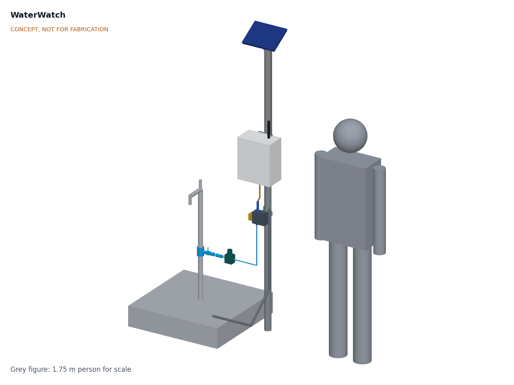
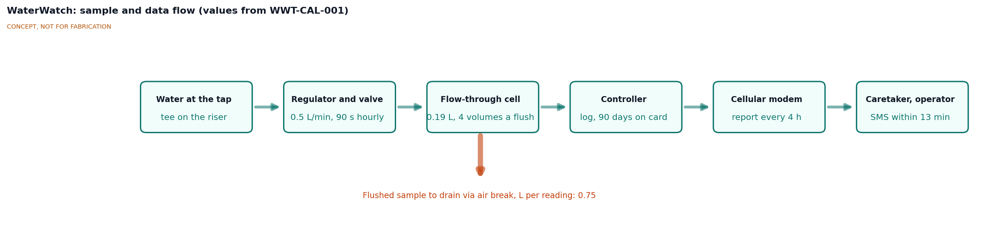
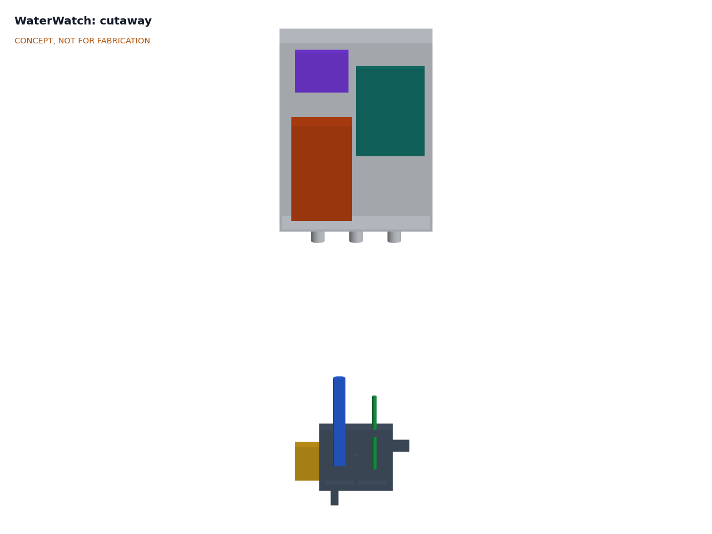
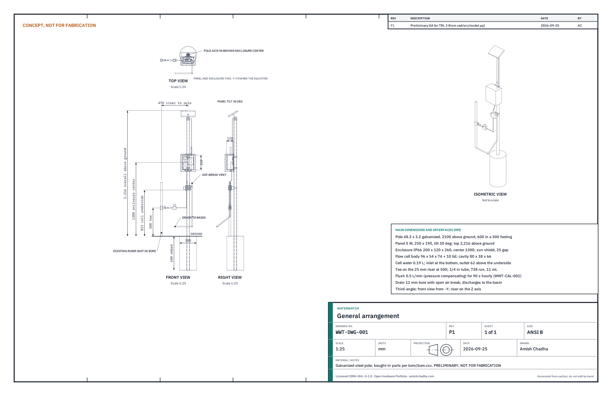
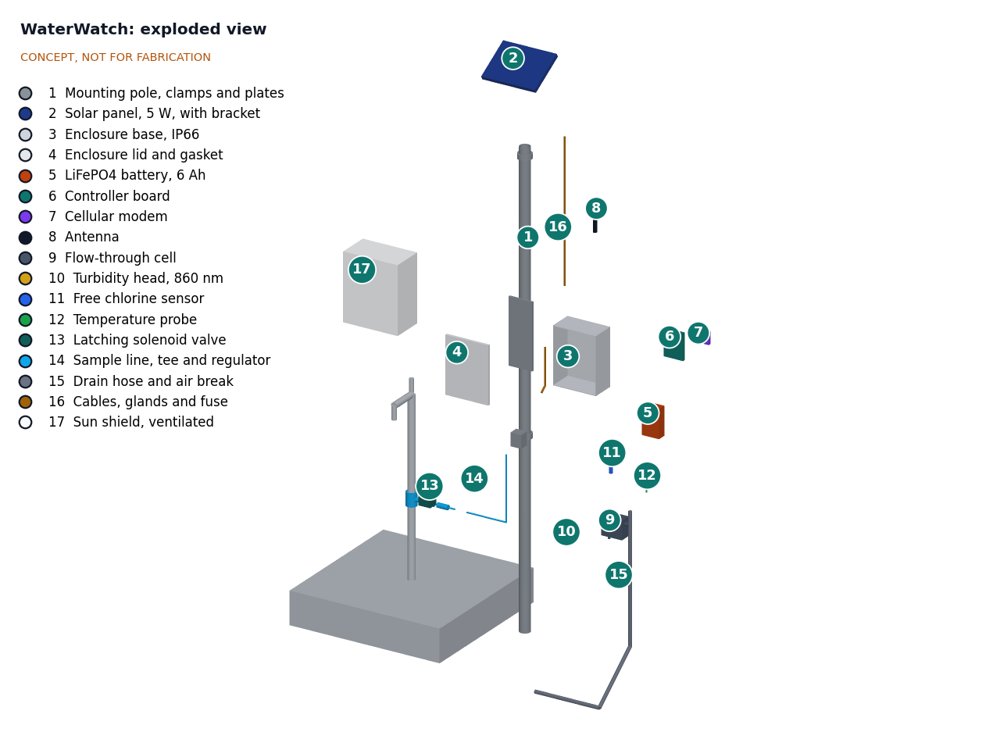

# WaterWatch design precis

WaterWatch is a solar sentinel that stands on its own pole beside a village tapstand. Once an hour a latching valve on a tee in the tapstand riser opens for 90 s and flushes water through a small, dark flow-through cell. An infrared nephelometer measures turbidity, a membrane-free three-electrode sensor measures free chlorine and a sealed probe measures temperature. An ESP32 controller logs the readings, a cellular modem uploads them every 4 h, and an SMS goes to the caretaker and operator when chlorine drops below 0.2 mg/L or turbidity passes 5 NTU. The TRL 3 calculations (WWT-CAL-001) give 0.54 Wh per day, 28.6 days on a 3.2 V, 6 Ah LiFePO4 battery without sun, 18.0 L per day of flushed water and $282 in parts. The weak point is still the chlorine reading: with a site pH entered by hand, pH changes alone exceed the ±0.1 mg/L target of R1 at pH 7.5 and above, and the low-cost sensor's drift over months is unknown, so R1 and R10 are not met. The design choices below were decided by Amish on 2026-09-25 (WWT-DDR-001).

*Figure 1. WaterWatch beside an existing tapstand (grey), with a 1.75 m person for scale. Solar panel on top, electronics enclosure under a white sun shield at eye height, flow-through cell below it, latching valve and sample line from a tee on the tapstand riser, drain hose to the tapstand basin. Rendered from the parametric model `cad/src/model.py`.*

## How it works

1. **Sample.** A saddle tee with an isolation valve on the tapstand riser feeds a strainer, a check valve, a pressure-compensating flow regulator (0.5 L/min) and a normally closed, direct-acting latching solenoid valve. Every hour the controller opens the valve for 90 s, flushing 0.75 L, about four volumes of the 0.19 L cell, then closes it. The sample enters at the bottom of the cell and leaves near the top, so the cell stays full and the electrodes stay wet between flushes. The outlet rises to an open air-break vent before the drain hose falls to the basin, so the hose cannot siphon the cell empty and the drain can never connect back to the cell.
2. **Measure.** During the last 10 s of flow the controller reads the chlorine sensor, because amperometric sensors need steady flow across the electrode. After the valve closes it waits 30 s for bubbles to rise clear, then reads turbidity for 5 s and temperature. The cell is opaque so daylight does not reach the turbidity detector.
3. **Log.** Each reading is stored with a timestamp on a microSD card (90 days or more) and in a short ring buffer in flash.
4. **Report.** Every 4 h the modem wakes, attaches to LTE-M, NB-IoT or 2G, and posts a compact batch to an open endpoint the operator chooses. If two consecutive readings cross a threshold, it sends an SMS at once, retrying up to three times at 3 min spacing, without waiting for the next upload.
5. **Power.** A 5 W panel charges a 3.2 V, 6 Ah LiFePO4 battery through a small solar charger with temperature cut-offs. A ventilated sun shield keeps the enclosure cool enough for the battery to charge on hot days. Everything else sleeps between readings.

*Figure 2. Sample and data flow. Values from WWT-CAL-001 for the default hourly schedule.*

## Main components

Table 1. Main components. Numbers match `bom/bom.csv` and Figure 5.

| # | Component | Choice | Notes |
| --- | --- | --- | --- |
| 1 | Mounting pole and clamps | 48.3 x 3.2 mm galvanized tube, 2.1 m above ground, 0.6 m in a 300 mm concrete footing beside the tapstand, U-bolt clamps and mounting plates | Keeps the tapstand itself unchanged; factor 4.5 in a 35 m/s gust (WWT-CAL-001, I) |
| 2 | Solar panel | 5 W monocrystalline, about 250 x 190 mm, tilted 30° toward the equator | Oversized for the load so cloudy weeks are covered |
| 3 | Enclosure base | IP66 polycarbonate, 200 x 120 x 260 mm, UV-stabilized, pressure-equalizing vent, cable glands underneath | Light grey, under the sun shield (item 17) |
| 4 | Enclosure lid and gasket | Supplied with item 3; tamper-resistant screws | |
| 5 | Battery | LiFePO4, 1S2P 32700 cells, 3.2 V, 6 Ah (19.2 Wh), protection board and NTC | Chemistry chosen for heat tolerance and thermal stability |
| 6 | Controller board | ESP32-S3 module, LiFePO4 solar charger, LMP91000-class potentiostat front end, valve driver with boost to 12 V, microSD, real-time clock | Carrier board; a custom PCB is TRL 4 work |
| 7 | Cellular modem | LTE-M and NB-IoT with 2G fallback (SIM7000G class), SIM | Swappable; LoRaWAN module as a variant (WWT-DDR-001, D3) |
| 8 | Antenna | External LTE and GSM whip on a bulkhead | |
| 9 | Flow-through cell | Opaque black PVC or printed ASA block, 96 x 54 x 74 mm with a 10 mm lid, 80 x 38 x 66 mm cavity, 0.19 L of water, baffle, inlet at the bottom and outlet near the top | Half the TRL 2 volume so the flush clears it; opens without tools for cleaning |
| 10 | Turbidity head | 860 nm infrared LED with light-to-frequency detectors at 90° (scatter) and 180° (reference), after [Kelley et al. (2014)](https://www.mdpi.com/1424-8220/14/4/7142) | ISO 7027 style wavelength |
| 11 | Free chlorine sensor | Membrane-free three-electrode sensor: graphite working electrode, Ag/AgCl reference, stainless counter, in a PVC holder, after [Pan et al. (2015)](https://pubs.acs.org/doi/10.1021/acs.analchem.5b03164) | Decided (WWT-DDR-001, D1); long-term drift unknown |
| 12 | Temperature probe | DS18B20 in a stainless sheath | Also used for chlorine sensor temperature compensation |
| 13 | Latching solenoid valve | 12 V, 1/4 in (6.35 mm) port, normally closed, direct acting, food-safe wetted parts | Latching, so it draws power only while switching; direct acting so it opens at 0.5 bar |
| 14 | Sample line | Saddle tee with isolation ball valve, strainer, check valve, pressure-compensating 0.5 L/min regulator, 1/4 in food-grade PE tube | The only change to the tapstand; the regulator holds R8 from 0.7 to 4 bar |
| 15 | Drain hose and air break | Outlet elbow with an open air-break vent, then 12 mm hose to the tapstand basin | Basin by default, soakaway or container per site (WWT-DDR-001, D7) |
| 16 | Cables, glands and fuse | Sensor and panel leads, IP68 glands, battery fuse | |
| 17 | Sun shield | White aluminum hood with a 25 mm ventilated gap over the enclosure top, sides and front; lifts off | Added at TRL 3 so the battery can charge on hot days (WWT-CAL-001, C) |

*Figure 3. Section on the center plane, looking at the front, with the sun shield removed. Top: enclosure with the modem (7, purple) and battery (5, orange) on the left and the controller board (6, teal) on the right. Bottom: flow-through cell (9) with the chlorine sensor (11, blue) and temperature probe (12, green) entering from the top, the turbidity head (10, yellow) on the left side and the outlet near the top on the right.*

## Key numbers

All values come from WWT-CAL-001, which states its assumptions; the tags in brackets are the lines of `docs/04-calcs/sizing.py` that print them. The main assumptions are hourly readings, 130 s awake per reading at 0.264 W, a 50 µA sleep floor, six uploads a day at 20 mWh each, a 1.5 margin and 4.5 peak sun hours with a 0.6 derating.

*Table 2. Key numbers.*

| Quantity | Value | Basis | Requirement |
| --- | --- | --- | --- |
| Daily energy with margin | 0.537 Wh/day | 0.229 Wh measuring, 0.120 Wh uploads, 9 mWh sleep and valve, x 1.5 [A3] | |
| Autonomy without sun | 28.6 days (24.3 at 0 °C) | 15.36 Wh usable [B1] | R7 met on paper |
| Solar yield, 5 W panel | 13.5 Wh per clear day, 7.5 Wh overcast | [B2]; 1.18 clear days to refill [B3] | R7 met on paper |
| Enclosure peak on a 45 °C day | 50.8 °C with the sun shield; 69.8 °C without | Dusty enclosure, sun square to the front [C4] | R9 at risk |
| Flow-through cell | 0.185 L of water | Parametric model [D1] | |
| Water per reading and per day | 0.75 L; 18.0 L (19.8 L at regulator tolerance) | 0.5 L/min for 90 s, 24 readings [D2], [D5] | R8 met on paper, thin margin |
| Old water left at the chlorine reading | 2.9 % | Well-mixed cell [D3] | R1 |
| Chlorine error at 0.5 mg/L, pH 7.5 | ±0.131 mg/L before drift | Site pH ±0.2 between visits, DPD reference [E4] | R1 not met |
| Data per month | 0.86 MB | 780 B payload and 4 kB overhead per upload [G1] | R6 met on paper |
| Confirmation to SMS | 13.0 min worst case | Three tries at 3 min spacing [H1] | R5 met on paper |
| Parts cost | $282 | `bom/bom.csv` [K1] | R12 met on paper, $18 margin |
| Shared calibration kit | about $60 | DPD free chlorine and pH comparator, turbidity standards (estimate) | Not in the unit cost |

The chlorine reading is the least certain number. Free chlorine is the sum of hypochlorous acid (HOCl) and hypochlorite (OCl⁻); their split depends on pH, with a pKa of 7.54 at 25 °C, so at pH 8 only 0.26 of free chlorine is HOCl, while at pH 7 0.77 is [E2]. Amperometric sensors respond mainly to HOCl, so the same free chlorine gives very different signals across the pH range in R1. Calibrating at the site against the DPD comparator absorbs the pH on the day of calibration, but a change of 0.2 pH before the next visit shifts the reading by 12 % at pH 7.0, 22 % at pH 7.5 and 38 % at pH 8.0 [E4]. The site pH method is therefore adequate at near-neutral, stable sites and not elsewhere, which is why R1 is not met.

## Key design choices

Each choice below was decided by Amish on 2026-09-25, going with the recommendation (WWT-DDR-001). The options considered are kept for the record.

- **Chlorine sensor (D1).** Chosen: a membrane-free graphite three-electrode sensor with a potentiostat front end, after [Pan et al. (2015)](https://pubs.acs.org/doi/10.1021/acs.analchem.5b03164) and the [pencil graphite work in PLOS ONE (2021)](https://journals.plos.org/plosone/article?id=10.1371%2Fjournal.pone.0248142), about $25 in parts, with a monthly DPD comparison built into the maintenance routine. Not chosen: an industrial membrane amperometric probe, well proven but about $1,900 for the probe alone ([Sensorex FCL](https://sensorex.com/product/fcl-amperometric-free-chlorine-sensor/)); an ORP probe as a proxy, about $175 as a kit ([Atlas Scientific](https://atlas-scientific.com/kits/ezo-complete-orp-kit/)), which tracks chlorine only loosely. The long-term performance literature ([Water Science and Technology, 2025](https://iwaponline.com/wst/article/92/2/326/108695/Long-term-performance-of-low-cost-free-chlorine)) could not be checked in full; see `docs/REVIEW.md`.
- **pH (D2).** Chosen: site pH entered at installation and checked monthly, at no cost. A pH probe and interface (about $60 to $100, estimate) is a documented variant for sites whose pH varies; it would take the parts cost over the $300 budget, which stays unchanged. WWT-CAL-001 shows the probe meets R1 up to pH 7.5 at zero drift.
- **Sampling by timed flush (D5).** An hourly 90 s flush uses 18.0 L per day; continuous flow at 0.5 L/min would use 720 L. At TRL 3 the cell was halved in volume, the fixed restrictor replaced by a pressure-compensating regulator, and the outlet moved near the top with an air break, all within this decision.
- **Pole beside the tapstand (D4).** A separate pole keeps the panel above head height, keeps the electronics out of reach of splashing and buckets, and needs no drilling into the tapstand. The cost is one more concrete footing, which also sets the installation time (R11).
- **Connectivity (D3).** Cellular LTE-M and NB-IoT with 2G fallback and SMS alerts for the first build, with the modem as a swappable module so LoRaWAN is a variant; this keeps the "GSM or LoRa" pitch.
- **LiFePO4 battery (D9).** Chosen over lithium-ion 18650 cells for heat tolerance and thermal stability, with charging blocked below 0 °C and above 45 °C. At TRL 3 a ventilated sun shield was added because, without it, the enclosure stays above 45 °C for almost all of a clear hot day.
- **Default alert thresholds (D6).** Free chlorine below 0.2 mg/L and turbidity above 5 NTU, confirmed by two consecutive readings, adjustable per site.
- **Drain (D7).** To the tapstand basin by default, to a soakaway or a container for non-drinking use where users prefer, decided per site.
- **First site type (D8).** Tapstands first; tank outlets and kiosks later.
- **SwapCell (D10).** Not used: WaterWatch needs about 0.5 Wh per day, and the portfolio's 48 V SwapCell pack does not fit.

*Figure 4. General arrangement WWT-DWG-001, Rev P1, generated from `cad/src/model.py` by `cad/src/sheets.py`. Preliminary, not for fabrication.*

*Figure 5. Exploded view with BOM numbers. The tapstand (grey) is existing infrastructure and not in the BOM.*

## Safety

> **Safety:** WaterWatch is a monitoring aid, not a certification of water safety. A normal reading does not mean the water is free of pathogens or chemical contaminants; accredited laboratory testing, including microbiological testing, remains necessary. Alerts must be worded as measurements, never as "safe" or "unsafe".

> **Safety:** The design contains a lithium iron phosphate battery (19.2 Wh). Use cells with a protection board, a fuse at the battery, and charging cut-offs below 0 °C and above 45 °C. Keep the enclosure vented, light-colored and under its sun shield; WWT-CAL-001 shows that an unshaded enclosure reaches about 70 °C inside on a 45 °C day.

> **Safety:** The sample line connects to a pressurized drinking water supply. Fit an isolation valve and a check valve so nothing can flow back into the supply, use food-safe wetted materials, keep the open air break at the cell outlet, and never let the flushed sample return to the drinking water. Fitting the saddle tee needs the supply shut off unless a tool for tapping under pressure is used. Flushed water contains chlorine; drain it where it cannot pool against the tapstand or be mistaken for a separate water point.

> **Safety:** Calibration and cleaning use chemicals: DPD reagent tablets, and formazin turbidity standards, which are hazardous if made from their precursors. Use prepared, stabilized standards, gloves and the supplier's safety data sheets; do not make formazin in the field.

- The pole is a fall and impact hazard if it is not set properly; set it in concrete and keep sharp edges on the panel frame and clamps covered.
- Radio and battery equipment must meet local type-approval rules before any field installation.

## Open questions

- [ ] What does the published long-term data say about low-cost chlorine sensor drift, and what recalibration interval does it imply? (R1, R10; the WST 2025 paper is still unchecked in full)
- [ ] Does the sun shield cut the solar gain as much as assumed (a quarter)? (R9)
- [ ] How fast do the cell windows and the chlorine electrode foul at a turbid site, and does a monthly clean suffice? (R2, R10)
- [ ] How much does source pH move between monthly visits at candidate sites? (R1)
- [ ] Should R1 be relaxed, or the pH probe become standard above a site pH? Proposed in `docs/REVIEW.md`, awaiting Amish.
- [ ] Which alert language and recipients do caretakers and operators want, and who owns the data? Open, awaiting Amish and co-design (WWT-DDR-001, O2 and O3).
- [ ] First partner and region? Open, awaiting Amish; co-design partners are picked per area later (WWT-DDR-001, O1).
